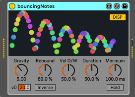

# bouncing notes

### _This is not an official device. If you were looking for that, please visit_ https://www.ableton.com/packs/

## What is this?
Particular Max for Live MIDI effect.

While note on, generates repeating notes like bouncing table-tennis ball
with dynamic display animation.
Simulates bounces from the levitation-ish on the Moon to fierce conditions of 60G.
Available in polyphonic and inverse mode!

## Download
https://maxforlive.com/library/device/6075/bouncing-notes

## Requirements
- Ableton Live 9.7.7 / Cycling '74 Max 6.1.7 or later

## Parameters
- `Gravity` Represents the gravity; how fast the velocity of balls decreases.
- `Velocity` The initial velocity of balls. 20 means to set 100*20m/msec. 100 means 2m/sec.
- `Rebound` Represents the coefficient of restitution. It's often written 'e'. As increasing - `Rebound` the velocity of echo notes decreases slower.
- `Vel D/W` Represents Velocity Dry/Wet ratio as known as velocity sensitivity.
- `Duration` Adjusts the ratio between the duration time of echo notes and bounces.
- `Minimum` The minimum bouncing time. It depends on 'HOLD' switch the behavior at the duration between bounces reached Minimum.
- `HOLD` When enabled, bouncing notes continue after the duration of bounces reached 'Minimum' time.
When disabled, bounces end at duration time of bounces reached 'Minimum' time.
- `DISP` Enable or disable the dynamic display animation.
- `Inverse` When enabled, the bounces are inverted; the duration of notes increases.
TIP: When inverse mode, you can start bounces from shorter duration by setting 'Velocity' to a small number (2-3).